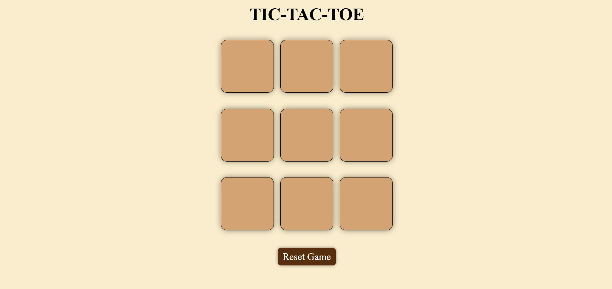

# Tic-Tac-Toe-Game  
A classic Tic Tac Toe game implemented with **HTML, CSS, and JavaScript**.  
Showcases fundamental web development concepts including DOM manipulation, game logic, and responsive design.  

## Features  
- Classic 3x3 Tic Tac Toe board  
- Two-player mode (O & X)  
- Win detection with highlight message  
- Draw detection  
- Reset & New Game functionality  
- Responsive and clean UI  

## Project Structure  
tic-tac-toe/
 │── index.html # Main game UI
 │── style.css # Styling
 │── script.js # Game logic

## How to Play  
1. Open `index.html` in your browser.  
2. Player **O** starts the game.  
3. Take turns placing your symbol (O or X) on the grid.  
4. The game announces the **winner** or a **draw**.  
5. Click **Reset Game** or **New Game** to play again.  

## Screenshot  
